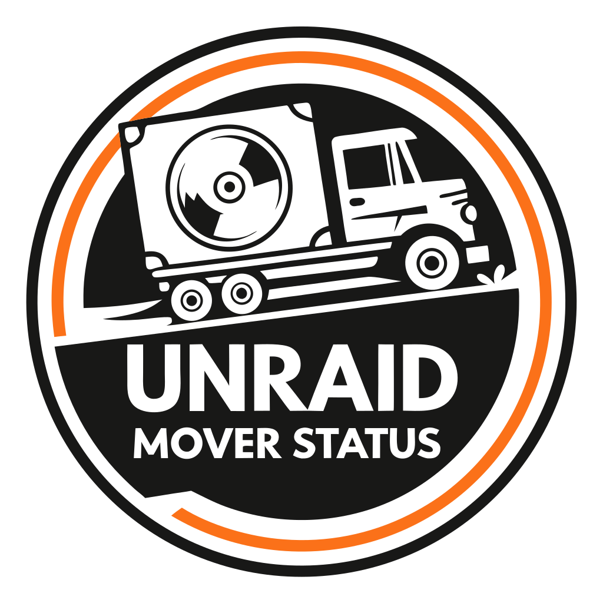

# Mover Status 

  

  
  
  
  

Monitor the Unraid mover process with a Python 3.14+ service that keeps the legacy bash behavior while adding plugin-based notifications and strict type safety.

## Overview
- Tracks mover lifecycle via `/var/run/mover.pid` with the same detection, progress, and ETC algorithms used in the original bash script (defaults: 0/25/50/75/100 thresholds).
- Sends concurrent notifications through provider plugins (Discord, Telegram) with retry/backoff, syslog logging, and an optional dry-run mode.
- Structured concurrency (TaskGroup) keeps monitoring responsive while disk-usage sampling runs in threads.
- Configuration-first design: YAML files validated at startup with environment-variable substitution for secrets.

## Unraid Installation
1. Install Python 3.14+ and `uv` on Unraid (NerdTools is the simplest option).
2. Place this repository in a persistent path, e.g., `/boot/config/plugins/mover-status/`.
3. Copy templates to live configs:
   - `cp config/mover-status.yaml.template config/mover-status.yaml`
   - `cp config/providers/discord.yaml.template config/providers/discord.yaml`
   - `cp config/providers/telegram.yaml.template config/providers/telegram.yaml`
4. Edit the YAML files for your array paths, thresholds, exclusion paths, and provider secrets (use `${VAR_NAME}` for env vars).
5. From the project root, run a quick dry run: `uv run mover-status --config config/mover-status.yaml --dry-run`.
6. Add a User Scripts entry that runs `uv run mover-status --config /boot/config/plugins/mover-status/config/mover-status.yaml` in the background at array start.

## Quick Start
- Local dev (WSL/macOS/Linux): `uv sync` then `uv run mover-status --dry-run` to verify configs without sending webhooks.
- On Unraid: update configs, then `uv run mover-status --config config/mover-status.yaml`.
- Useful flags: `--log-level DEBUG`, `--no-syslog`, `--monitored-paths /mnt/cache,/mnt/cache2`.

## Configuration
- Main settings: `config/mover-status.yaml` controls monitoring intervals, thresholds, exclusions, retries, logging, and syslog.
- Provider settings: `config/providers/discord.yaml`, `config/providers/telegram.yaml` enable plugins and hold credentials.
- Environment variables resolved automatically using `${VAR_NAME}`. Templates sit beside each config for quick reference.

## Troubleshooting
- Mover not detected: confirm `/var/run/mover.pid` exists and monitored paths match your cache volumes.
- No notifications: ensure the provider is enabled in the main config and the matching YAML file exists with valid webhook/token values.
- Unexpected progress or ETC: verify exclusion paths and thresholds align with the legacy defaults (0/25/50/75/100) and the same calculation algorithm.
- Validation errors: rerun with `--dry-run --log-level DEBUG` and address any fields called out during startup.

## License

This project is licensed under the AGPLv3 License - see the LICENSE file for details.
